<!-- ═══════════════════════════════════════════════════════════════════════════ -->
<!-- ║  PROGRAMMING VISUALIZATION — ULTIMATE README                          ║ -->
<!-- ║  Built by issu321 (Mohammed Usman)                                      ║ -->
<!-- ║  AI-Powered Code Analysis & Neural Visualization Platform               ║ -->
<!-- ═══════════════════════════════════════════════════════════════════════════ -->

<div align="center">

<!-- ═══════════════════════════════════════════════════════════════════════════ -->
<!-- NEON PULSE HEADER                                                        -->
<!-- ═══════════════════════════════════════════════════════════════════════════ -->


<br>

<!-- ═══════════════════════════════════════════════════════════════════════════ -->
<!-- TYPING ANIMATION SUBTITLE                                                -->
<!-- ═══════════════════════════════════════════════════════════════════════════ -->


<br><br>

<!-- ═══════════════════════════════════════════════════════════════════════════ -->
<!-- NEON SHIELD BADGES                                                       -->
<!-- ═══════════════════════════════════════════════════════════════════════════ -->

<p>
  
  
  
  
  
  
</p>

<br>

<!-- ═══════════════════════════════════════════════════════════════════════════ -->
<!-- QUICK LINKS NAVIGATION BAR                                               -->
<!-- ═══════════════════════════════════════════════════════════════════════════ -->

<p>
  <a href="#-overview"></a>
  <a href="#-system-architecture"></a>
  <a href="#-neural-data-flow"></a>
  <a href="#-feature-matrix"></a>
  <a href="#-installation"></a>
  <a href="#-api-documentation"></a>
  <a href="#-contributing"></a>
</p>

</div>

<br>

<!-- ═══════════════════════════════════════════════════════════════════════════ -->
<!-- NEON WAVE DIVIDER 1                                                      -->
<!-- ═══════════════════════════════════════════════════════════════════════════ -->

<p align="center">
  
</p>

<br>

<!-- ═══════════════════════════════════════════════════════════════════════════ -->
<!-- SECTION 1: OVERVIEW                                                      -->
<!-- ═══════════════════════════════════════════════════════════════════════════ -->

<h1 align="center">
   
  Overview
</h1>

<div align="center">

```
╔══════════════════════════════════════════════════════════════════════════════╗
║                                                                              ║
║   🧠  PROGRAMMING VISUALIZATION  —  Where Source Code Meets Cognition       ║
║                                                                              ║
║   Transform raw code into stunning, interactive visual explanations.         ║
║   Upload, paste, or API-submit — watch the neural engine deconstruct         ║
║   your code into AST trees, call graphs, flowcharts, and complexity          ║
║   analyses in milliseconds.                                                  ║
║                                                                              ║
╚══════════════════════════════════════════════════════════════════════════════╝
```

</div>

<br>

**Programming Visualization** is a production-grade, Flask-based **AI Code Analysis & Visualization Platform** engineered for developers, educators, and students. It bridges the gap between raw syntax and visual comprehension through multi-layered neural parsing, real-time AST generation, and cinematic interactive charts.

### 🎯 Mission Statement

> *"Every line of code tells a story. We just make it visible."*
> — **issu321** (Mohammed Usman)

<br>

<!-- ═══════════════════════════════════════════════════════════════════════════ -->
<!-- LANGUAGE SUPPORT MATRIX                                                  -->
<!-- ═══════════════════════════════════════════════════════════════════════════ -->

<h3 align="center">🌐 Supported Languages</h3>

<div align="center">

| Language | Parser | AST Support | Complexity | Call Graph | Flowchart | Status |
|:--------:|:------:|:-----------:|:----------:|:----------:|:---------:|:------:|
| 🐍 **Python** | `ast` (Built-in) | ✅ Full | ✅ O(n) | ✅ Full | ✅ Full | 🟢 Production |
| ☕ **Java** | `javalang` | ✅ Full | ✅ O(n) | ✅ Full | ✅ Full | 🟢 Production |
| 🔷 **C** | `pycparser` | ✅ Full | ✅ O(n) | ✅ Full | ✅ Full | 🟢 Production |
| 🔷 **C++** | Regex + Heuristics | ✅ Partial | ✅ O(n) | ✅ Full | ✅ Full | 🟡 Beta |

</div>

<br>

<!-- ═══════════════════════════════════════════════════════════════════════════ -->
<!-- NEON WAVE DIVIDER 2                                                      -->
<!-- ═══════════════════════════════════════════════════════════════════════════ -->

<p align="center">
  
</p>

<br>

<!-- ═══════════════════════════════════════════════════════════════════════════ -->
<!-- SECTION 2: SYSTEM ARCHITECTURE — NEURAL LAYERS                           -->
<!-- ═══════════════════════════════════════════════════════════════════════════ -->

<h1 align="center">
   
  System Architecture
</h1>

<h3 align="center">🏗️ Neural Layer Architecture</h3>

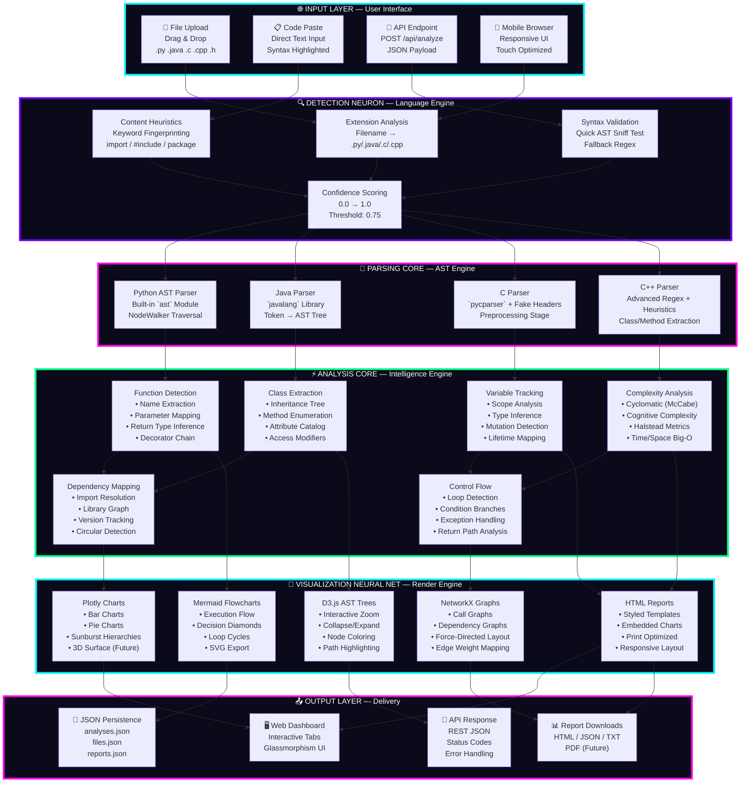

<br>

<!-- ═══════════════════════════════════════════════════════════════════════════ -->
<!-- COMPONENT INTERACTION DIAGRAM                                            -->
<!-- ═══════════════════════════════════════════════════════════════════════════ -->

<h3 align="center">🧩 Component Interaction Diagram</h3>

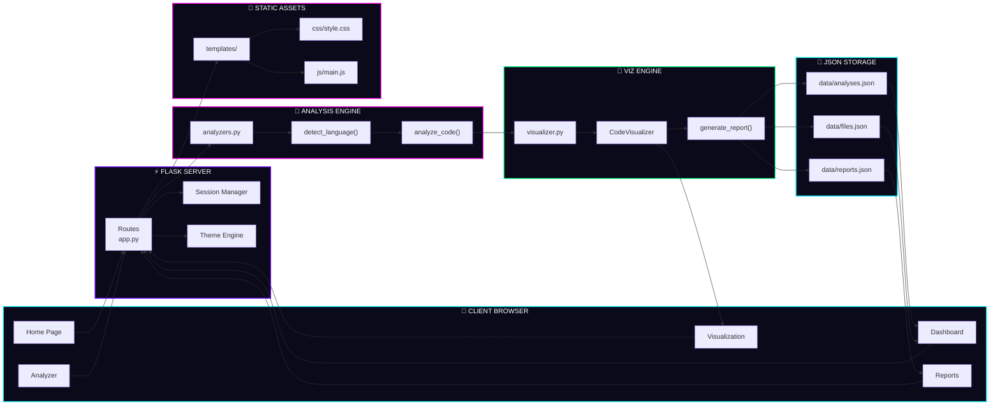

<br>

<!-- ═══════════════════════════════════════════════════════════════════════════ -->
<!-- NEON WAVE DIVIDER 3                                                      -->
<!-- ═══════════════════════════════════════════════════════════════════════════ -->

<p align="center">
  
</p>

<br>

<!-- ═══════════════════════════════════════════════════════════════════════════ -->
<!-- SECTION 3: NEURAL DATA FLOW                                              -->
<!-- ═══════════════════════════════════════════════════════════════════════════ -->

<h1 align="center">
   
  Neural Data Flow
</h1>

<h3 align="center">🔄 Complete Request Lifecycle Pipeline</h3>

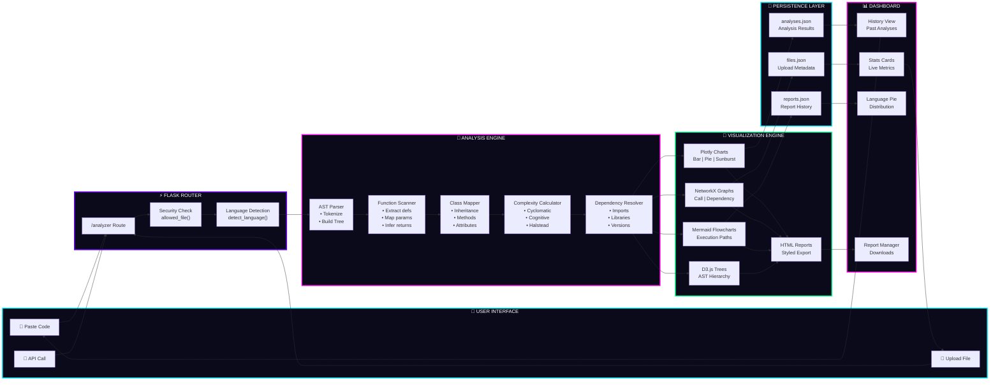

<br>

<h3 align="center">🧬 State Machine — Analysis Lifecycle</h3>

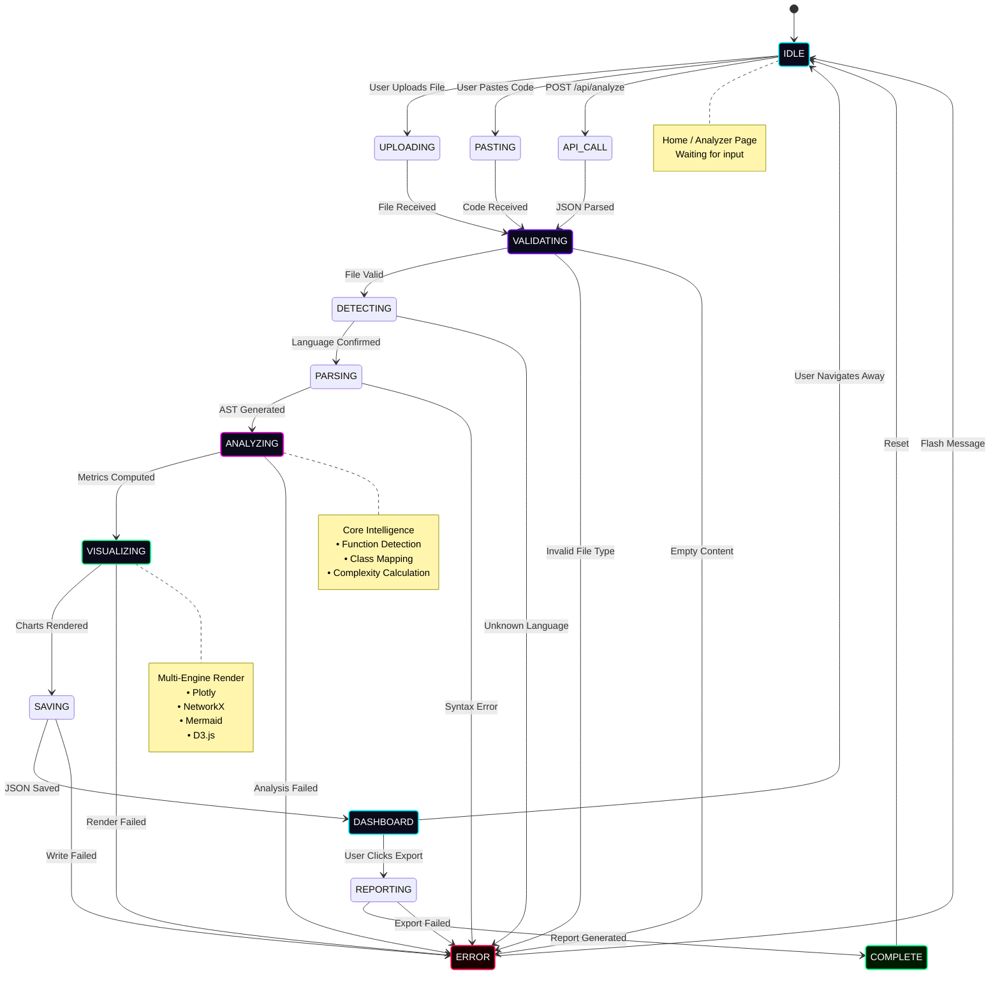

<br>

<h3 align="center">🎯 Decision Tree — Language Detection</h3>

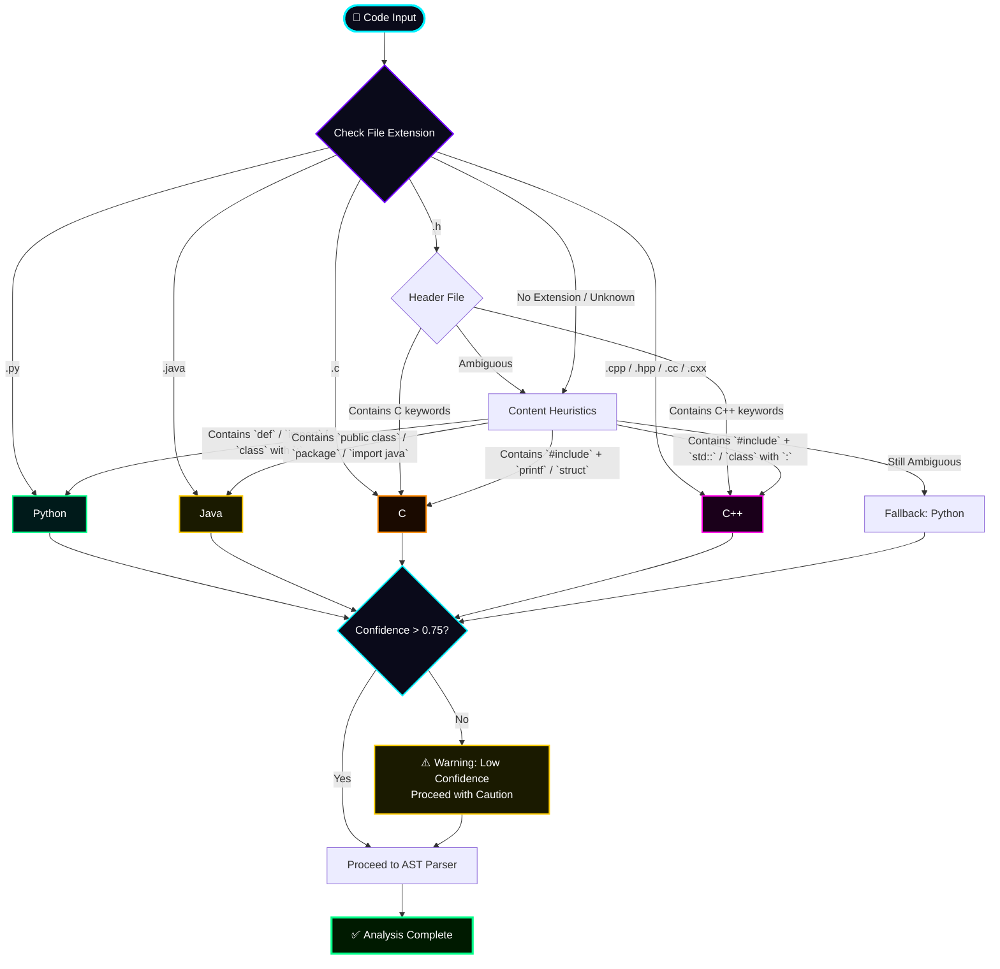

<br>

<!-- ═══════════════════════════════════════════════════════════════════════════ -->
<!-- NEON WAVE DIVIDER 4                                                      -->
<!-- ═══════════════════════════════════════════════════════════════════════════ -->

<p align="center">
  
</p>

<br>

<!-- ═══════════════════════════════════════════════════════════════════════════ -->
<!-- SECTION 4: FEATURE MATRIX                                                -->
<!-- ═══════════════════════════════════════════════════════════════════════════ -->

<h1 align="center">
   
  Feature Matrix
</h1>

<h3 align="center">🧠 Neural Feature Map</h3>

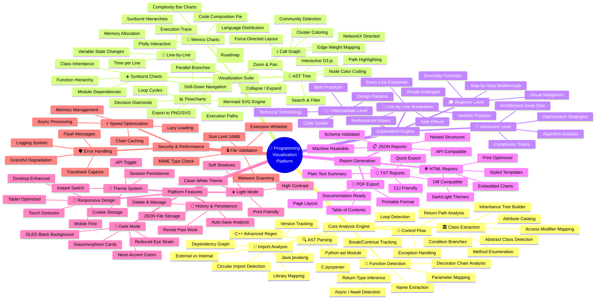

<br>

<h3 align="center">📊 Feature Completeness Radar</h3>

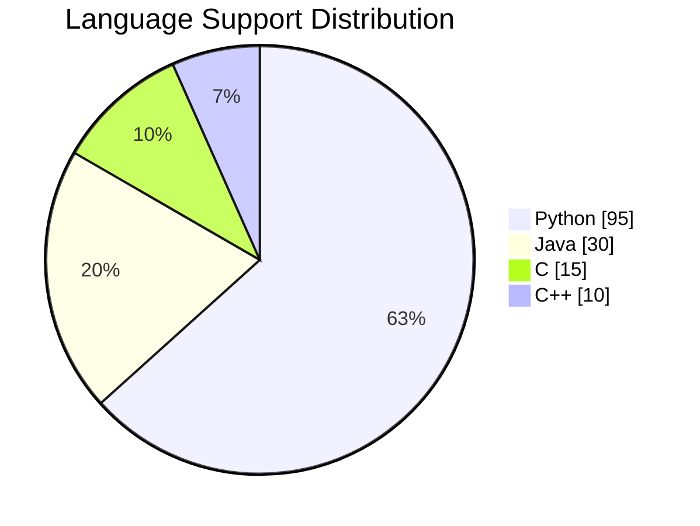

<br>

<!-- ═══════════════════════════════════════════════════════════════════════════ -->
<!-- NEON WAVE DIVIDER 5                                                      -->
<!-- ═══════════════════════════════════════════════════════════════════════════ -->

<p align="center">
  
</p>

<br>

<!-- ═══════════════════════════════════════════════════════════════════════════ -->
<!-- SECTION 5: INSTALLATION                                                  -->
<!-- ═══════════════════════════════════════════════════════════════════════════ -->

<h1 align="center">
   
  Installation
</h1>

<h3 align="center">🛠️ Deployment Architecture</h3>

```mermaid
graph TB
    subgraph DEV["💻 DEVELOPMENT"]
        D1["Git Clone"]
        D2["Virtual Env"]
        D3["pip install"]
        D4["python app.py"]
        D5["localhost:5000"]
    end

    subgraph DOCKER["🐳 DOCKER"]
        DO1["docker build"]
        DO2["docker run"]
        DO3["localhost:7860"]
    end

    subgraph HF["🤗 HUGGING FACE"]
        H1["Create Space"]
        H2["Docker SDK"]
        H3["git push"]
        H4["Auto Deploy"]
    end

    subgraph CLOUD["☁️ CLOUD"]
        C1["AWS / GCP / Azure"]
        C2["Docker Container"]
        C3["Load Balancer"]
        C4["SSL / HTTPS"]
    end

    D1 --> D2 --> D3 --> D4 --> D5
    DO1 --> DO2 --> DO3
    H1 --> H2 --> H3 --> H4
    C1 --> C2 --> C3 --> C4

    style DEV fill:#0a0a1a,stroke:#00f2ff,stroke-width:2px,color:#fff
    style DOCKER fill:#0a0a1a,stroke:#00ff88,stroke-width:2px,color:#fff
    style HF fill:#0a0a1a,stroke:#ff00e6,stroke-width:2px,color:#fff
    style CLOUD fill:#0a0a1a,stroke:#7000ff,stroke-width:2px,color:#fff
```

<br>

<h3 align="center">⚡ Quick Start — One Command Install</h3>

```bash
# ═══════════════════════════════════════════════════════════════════════════
# 🚀 CLONE & LAUNCH
# ═══════════════════════════════════════════════════════════════════════════

git clone https://github.com/issu321/Programming-Visualization.git
cd Programming-Visualization

# ═══════════════════════════════════════════════════════════════════════════
# 🪟 WINDOWS
# ═══════════════════════════════════════════════════════════════════════════
install.bat

# ═══════════════════════════════════════════════════════════════════════════
# 🐧 LINUX / MAC
# ═══════════════════════════════════════════════════════════════════════════
chmod +x install.sh && ./install.sh

# ═══════════════════════════════════════════════════════════════════════════
# 🐳 DOCKER
# ═══════════════════════════════════════════════════════════════════════════
docker build -t programming-visualization .
docker run -p 7860:7860 programming-visualization

# ═══════════════════════════════════════════════════════════════════════════
# 🌐 OPEN BROWSER
# ═══════════════════════════════════════════════════════════════════════════
# http://localhost:5000   (Local)
# http://localhost:7860   (Docker)
```

<br>

<h3 align="center">🔧 Manual Installation Steps</h3>

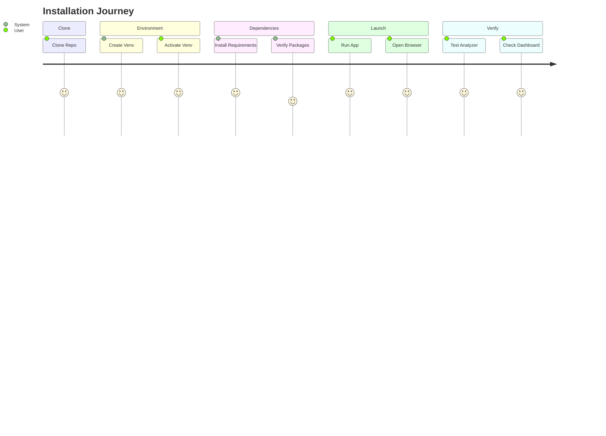

<br>

<!-- ═══════════════════════════════════════════════════════════════════════════ -->
<!-- NEON WAVE DIVIDER 6                                                      -->
<!-- ═══════════════════════════════════════════════════════════════════════════ -->

<p align="center">
  
</p>

<br>

<!-- ═══════════════════════════════════════════════════════════════════════════ -->
<!-- SECTION 6: API DOCUMENTATION                                             -->
<!-- ═══════════════════════════════════════════════════════════════════════════ -->

<h1 align="center">
   
  API Documentation
</h1>

<h3 align="center">🔄 API Request/Response Lifecycle</h3>

```mermaid
sequenceDiagram
    autonumber
    participant CLIENT as 📱 Client / Browser
    participant FLASK as ⚡ Flask Server
    participant ANALYZER as 🔍 analyzers.py
    participant VIZ as 🎨 visualizer.py
    participant JSON as 💾 JSON Storage

    rect rgb(10,10,26)
        Note over CLIENT,JSON: POST /api/analyze
    end

    CLIENT->>FLASK: POST /api/analyze<br/>Content-Type: application/json<br/>{code, filename}
    FLASK->>FLASK: detect_language(code, filename)
    FLASK->>ANALYZER: analyze_code(code, filename)

    rect rgb(20,10,30)
        Note over ANALYZER: AST Parsing Phase
    end

    ANALYZER->>ANALYZER: Parse AST (Language Specific)
    ANALYZER->>ANALYZER: Extract Functions
    ANALYZER->>ANALYZER: Extract Classes
    ANALYZER->>ANALYZER: Calculate Complexity
    ANALYZER->>ANALYZER: Map Dependencies
    ANALYZER-->>FLASK: analysis_result {}

    rect rgb(10,26,10)
        Note over VIZ: Visualization Phase
    end

    FLASK->>VIZ: generate_all_visualizations()
    VIZ->>VIZ: Plotly Charts
    VIZ->>VIZ: NetworkX Graphs
    VIZ->>VIZ: Mermaid Flowcharts
    VIZ->>VIZ: D3.js AST Trees
    VIZ-->>FLASK: visualizations {}

    rect rgb(26,10,10)
        Note over JSON: Persistence Phase
    end

    FLASK->>JSON: _save_analysis()
    JSON-->>FLASK: analysis_id

    rect rgb(10,10,40)
        Note over CLIENT,FLASK: Response Delivery
    end

    FLASK-->>CLIENT: 200 OK<br/>{success, analysis_id, analysis, visualizations}

    CLIENT->>FLASK: GET /visualization/42
    FLASK->>JSON: _get_analysis_by_id(42)
    JSON-->>FLASK: analysis {}
    FLASK-->>CLIENT: Render visualization.html
```

<br>

<h3 align="center">📡 Endpoint Reference</h3>

| Method | Endpoint | Description | Auth |
|:------:|:---------|:------------|:----:|
| `GET` | `/` | Home Page with Stats | ❌ Public |
| `GET` | `/analyzer` | Code Input Interface | ❌ Public |
| `POST` | `/analyze` | Submit Code for Analysis | ❌ Public |
| `GET` | `/visualization/<id>` | View Analysis Results | ❌ Public |
| `GET` | `/dashboard` | Analysis History | ❌ Public |
| `GET` | `/reports` | Report Management | ❌ Public |
| `GET` | `/database` | Stats & Data View | ❌ Public |
| `POST` | `/api/analyze` | REST API Analysis | ❌ Public |
| `GET` | `/api/stats` | Platform Statistics | ❌ Public |
| `POST` | `/api/theme` | Toggle Theme | ❌ Public |

<br>

<h3 align="center">🔬 Sample API Request</h3>

```json
// ═══════════════════════════════════════════════════════════════════════════
// REQUEST: POST /api/analyze
// ═══════════════════════════════════════════════════════════════════════════

{
  "code": "def fibonacci(n):\n    if n <= 1:\n        return n\n    return fibonacci(n-1) + fibonacci(n-2)",
  "filename": "fibonacci.py"
}

// ═══════════════════════════════════════════════════════════════════════════
// RESPONSE: 200 OK
// ═══════════════════════════════════════════════════════════════════════════

{
  "success": true,
  "analysis_id": 42,
  "analysis": {
    "detected_language": "python",
    "functions": [
      {
        "name": "fibonacci",
        "parameters": ["n"],
        "return_type": "inferred",
        "complexity": "O(2^n)",
        "lines": [1, 4],
        "docstring": null,
        "decorators": []
      }
    ],
    "classes": [],
    "imports": [],
    "complexity": {
      "cyclomatic": 2,
      "cognitive": 3,
      "halstead": {
        "difficulty": 4.5,
        "effort": 450,
        "volume": 100
      }
    },
    "metrics": {
      "total_lines": 4,
      "code_lines": 4,
      "comment_lines": 0,
      "blank_lines": 0
    }
  },
  "visualizations": {
    "ast_tree": {
      "nodes": [{"id": 1, "type": "FunctionDef", "name": "fibonacci"}],
      "edges": [{"source": 1, "target": 2}]
    },
    "call_graph": {
      "nodes": [{"id": "fibonacci", "label": "fibonacci(n)"}],
      "edges": [{"source": "fibonacci", "target": "fibonacci"}]
    },
    "flowchart": "graph TD; A[Start] --> B{n <= 1}; B -->|Yes| C[Return n]; B -->|No| D[Return fib(n-1) + fib(n-2)]",
    "complexity_chart": {"data": [{"x": ["fibonacci"], "y": [2], "type": "bar"}]}
  }
}
```

<br>

<!-- ═══════════════════════════════════════════════════════════════════════════ -->
<!-- NEON WAVE DIVIDER 7                                                      -->
<!-- ═══════════════════════════════════════════════════════════════════════════ -->

<p align="center">
  
</p>

<br>

<!-- ═══════════════════════════════════════════════════════════════════════════ -->
<!-- SECTION 7: PROJECT STRUCTURE                                             -->
<!-- ═══════════════════════════════════════════════════════════════════════════ -->

<h1 align="center">
   
  Project Structure
</h1>

<h3 align="center">🗂️ File Tree with Neural Connections</h3>

```mermaid
graph TD
    ROOT["📦 Programming-Visualization/<br/>GitHub Repo Root"] --> APP["⚡ app.py<br/>Flask Application<br/>Routes & Views"]
    ROOT --> ANA["🔍 analyzers.py<br/>Code Analysis Engine<br/>AST & Parsing"]
    ROOT --> VIZ["🎨 visualizer.py<br/>Visualization Generator<br/>Charts & Graphs"]
    ROOT --> REQ["📋 requirements.txt<br/>Python Dependencies"]
    ROOT --> DOCK["🐳 Dockerfile<br/>Container Config"]
    ROOT --> INST1["🪟 install.bat<br/>Windows Installer"]
    ROOT --> INST2["🐧 install.sh<br/>Linux Installer"]
    ROOT --> README["📖 README.md<br/>This File"]
    ROOT --> LICENSE["📄 LICENSE<br/>MIT License"]

    ROOT --> TEMPLATES["📁 templates/<br/>Jinja2 HTML Templates"]
    ROOT --> STATIC["📁 static/<br/>CSS / JS / Images"]
    ROOT --> UPLOADS["📁 uploads/<br/>Uploaded Code Files"]
    ROOT --> REPORTS["📁 reports/<br/>Generated Reports"]
    ROOT --> DATA["📁 data/<br/>JSON Storage"]

    TEMPLATES --> T1["base.html<br/>Base Layout"]
    TEMPLATES --> T2["home.html<br/>Landing Page"]
    TEMPLATES --> T3["analyzer.html<br/>Code Input"]
    TEMPLATES --> T4["visualization.html<br/>Results & Charts"]
    TEMPLATES --> T5["dashboard.html<br/>History & Stats"]
    TEMPLATES --> T6["reports.html<br/>Report Manager"]
    TEMPLATES --> T7["database.html<br/>Data View"]
    TEMPLATES --> T8["features.html<br/>Feature Showcase"]
    TEMPLATES --> T9["contact.html<br/>Contact Page"]

    STATIC --> CSS["📁 css/"]
    STATIC --> JS["📁 js/"]
    STATIC --> IMG["📁 images/"]

    CSS --> C1["style.css<br/>Glassmorphism<br/>Neon Theme"]
    JS --> J1["main.js<br/>Interactivity<br/>Theme Toggle"]

    DATA --> D1["📄 analyses.json<br/>Analysis Results"]
    DATA --> D2["📄 files.json<br/>Upload Metadata"]
    DATA --> D3["📄 reports.json<br/>Report History"]

    APP --> TEMPLATES
    APP --> STATIC
    APP --> DATA
    ANA --> APP
    VIZ --> APP

    style ROOT fill:#0a0a1a,stroke:#00f2ff,stroke-width:4px,color:#fff
    style APP fill:#0a0a1a,stroke:#ff00e6,stroke-width:3px,color:#fff
    style ANA fill:#0a0a1a,stroke:#7000ff,stroke-width:3px,color:#fff
    style VIZ fill:#0a0a1a,stroke:#00ff88,stroke-width:3px,color:#fff
    style TEMPLATES fill:#0a0a1a,stroke:#00f2ff,stroke-width:2px,color:#fff
    style STATIC fill:#0a0a1a,stroke:#ff00e6,stroke-width:2px,color:#fff
    style DATA fill:#0a0a1a,stroke:#00ff88,stroke-width:2px,color:#fff
```

<br>

<!-- ═══════════════════════════════════════════════════════════════════════════ -->
<!-- NEON WAVE DIVIDER 8                                                      -->
<!-- ═══════════════════════════════════════════════════════════════════════════ -->

<p align="center">
  
</p>

<br>

<!-- ═══════════════════════════════════════════════════════════════════════════ -->
<!-- SECTION 8: JSON STORAGE SCHEMA                                           -->
<!-- ═══════════════════════════════════════════════════════════════════════════ -->

<h1 align="center">
   
  Data Schema
</h1>

<h3 align="center">💾 JSON Storage Entity Relationship</h3>

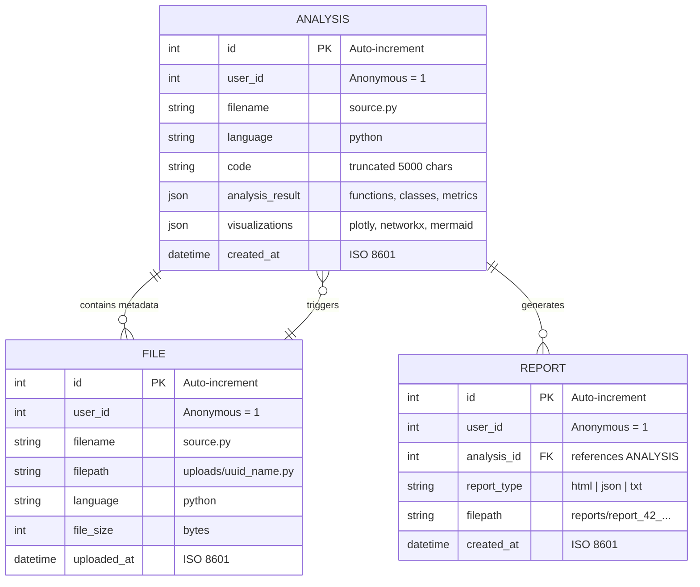

<br>

<!-- ═══════════════════════════════════════════════════════════════════════════ -->
<!-- NEON WAVE DIVIDER 9                                                      -->
<!-- ═══════════════════════════════════════════════════════════════════════════ -->

<p align="center">
  
</p>

<br>

<!-- ═══════════════════════════════════════════════════════════════════════════ -->
<!-- SECTION 9: USAGE GUIDE                                                   -->
<!-- ═══════════════════════════════════════════════════════════════════════════ -->

<h1 align="center">
   
  Usage Guide
</h1>

<h3 align="center">🎮 User Journey Map</h3>


<br>

<h3 align="center">🗺️ Navigation Flowchart</h3>

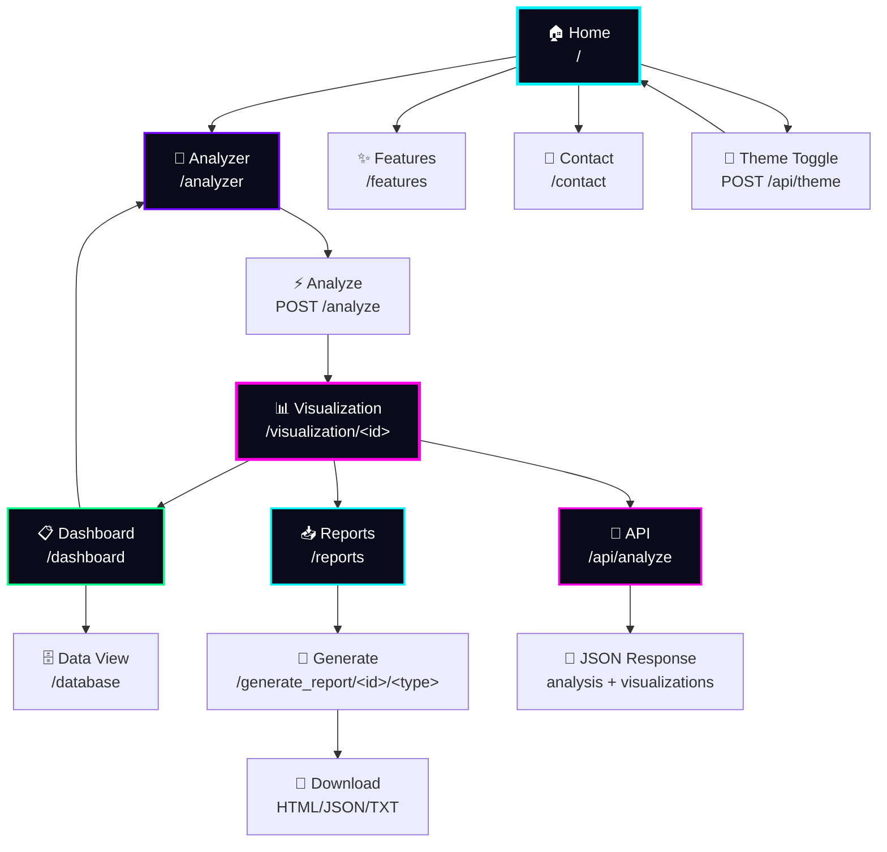

<br>

<!-- ═══════════════════════════════════════════════════════════════════════════ -->
<!-- NEON WAVE DIVIDER 10                                                     -->
<!-- ═══════════════════════════════════════════════════════════════════════════ -->

<p align="center">
  
</p>

<br>

<!-- ═══════════════════════════════════════════════════════════════════════════ -->
<!-- SECTION 10: TECHNOLOGY STACK                                             -->
<!-- ═══════════════════════════════════════════════════════════════════════════ -->

<h1 align="center">
   
  Technology Stack
</h1>

<h3 align="center">⚙️ Full Stack Neural Network</h3>

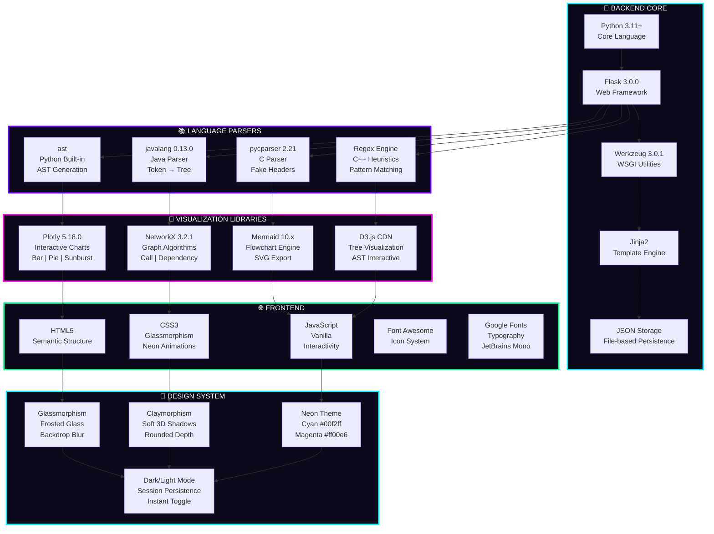

<br>

<!-- ═══════════════════════════════════════════════════════════════════════════ -->
<!-- NEON WAVE DIVIDER 11                                                     -->
<!-- ═══════════════════════════════════════════════════════════════════════════ -->

<p align="center">
  
</p>

<br>

<!-- ═══════════════════════════════════════════════════════════════════════════ -->
<!-- SECTION 11: ROADMAP                                                      -->
<!-- ═══════════════════════════════════════════════════════════════════════════ -->

<h1 align="center">
   
  Roadmap
</h1>

<h3 align="center">🗓️ Development Timeline</h3>

```mermaid
gantt
    title Programming Visualization Roadmap 2024-2025
    dateFormat YYYY-MM-DD
    section Core Platform
        Flask Backend           :done, core1, 2024-01-01, 2024-02-15
        JSON Storage Engine     :done, core2, 2024-02-01, 2024-03-01
        Multi-Language Parser   :done, core3, 2024-03-01, 2024-04-15
        Theme System            :done, core4, 2024-04-01, 2024-04-30
    section Visualizations
        Plotly Charts           :done, viz1, 2024-05-01, 2024-05-30
        NetworkX Graphs         :done, viz2, 2024-06-01, 2024-06-30
        Mermaid Flowcharts      :done, viz3, 2024-07-01, 2024-07-31
        D3.js AST Trees         :active, viz4, 2024-08-01, 2024-09-15
        3D Code City            :future, viz5, 2024-10-01, 2024-12-31
    section AI Features
        Complexity Predictor    :active, ai1, 2024-09-01, 2024-10-31
        Code Smell Detector     :future, ai2, 2024-11-01, 2025-01-31
        Auto-Refactor Suggest   :future, ai3, 2025-02-01, 2025-04-30
        Natural Language Query  :future, ai4, 2025-05-01, 2025-07-31
    section Platform
        Docker Deployment       :done, plat1, 2024-06-01, 2024-06-15
        Hugging Face Spaces     :done, plat2, 2024-07-01, 2024-07-15
        User Authentication     :future, plat3, 2024-10-01, 2024-11-30
        Cloud Scaling           :future, plat4, 2025-01-01, 2025-03-31
```

<br>

<!-- ═══════════════════════════════════════════════════════════════════════════ -->
<!-- NEON WAVE DIVIDER 12                                                     -->
<!-- ═══════════════════════════════════════════════════════════════════════════ -->

<p align="center">
  
</p>

<br>

<!-- ═══════════════════════════════════════════════════════════════════════════ -->
<!-- SECTION 12: CONTRIBUTING                                                   -->
<!-- ═══════════════════════════════════════════════════════════════════════════ -->

<h1 align="center">
   
  Contributing
</h1>

<h3 align="center">🌟 Contribution Workflow</h3>

```mermaid
graph LR
    subgraph FORK["🍴 FORK & BRANCH"]
        F1["Fork Repository<br/>GitHub"]
        F2["Clone Fork<br/>git clone"]
        F3["Create Branch<br/>feature/xyz"]
    end

    subgraph CODE["💻 DEVELOP"]
        C1["Write Code<br/>analyzers.py / visualizer.py"]
        C2["Run Tests<br/>Local Validation"]
        C3["Commit Changes<br/>git commit -m"]
    end

    subgraph PUSH["📤 SUBMIT"]
        P1["Push to Origin<br/>git push"]
        P2["Open PR<br/>GitHub UI"]
        P3["Code Review<br/>Maintainer Check"]
    end

    subgraph MERGE["✅ MERGE"]
        M1["Approve & Merge<br/>Squash / Rebase"]
        M2["Deploy<br/>Production"]
        M3["🎉 Celebrate!"]
    end

    F1 --> F2 --> F3 --> C1 --> C2 --> C3 --> P1 --> P2 --> P3 --> M1 --> M2 --> M3

    style FORK fill:#0a0a1a,stroke:#00f2ff,stroke-width:2px,color:#fff
    style CODE fill:#0a0a1a,stroke:#7000ff,stroke-width:2px,color:#fff
    style PUSH fill:#0a0a1a,stroke:#ff00e6,stroke-width:2px,color:#fff
    style MERGE fill:#0a0a1a,stroke:#00ff88,stroke-width:2px,color:#fff
```

<br>

<h3 align="center">🐙 Git Contribution Graph</h3>

```mermaid
%%{init: { 'theme': 'dark', 'themeVariables': { 'git0': '#00f2ff', 'git1': '#7000ff', 'git2': '#ff00e6', 'git3': '#00ff88', 'git4': '#ffcc00', 'git5': '#ff4444', 'git6': '#00ccff', 'git7': '#cc00ff' }}}%%
gitgraph
    commit id: "Initial Commit"
    commit id: "Flask Setup"
    branch feature/ast-parser
    checkout feature/ast-parser
    commit id: "Python AST"
    commit id: "Java Parser"
    commit id: "C Parser"
    checkout main
    merge feature/ast-parser id: "Merge AST"
    branch feature/visualizations
    checkout feature/visualizations
    commit id: "Plotly Charts"
    commit id: "NetworkX Graphs"
    commit id: "Mermaid Flowcharts"
    checkout main
    merge feature/visualizations id: "Merge Viz"
    branch feature/json-storage
    checkout feature/json-storage
    commit id: "Remove SQLite"
    commit id: "JSON Engine"
    commit id: "Auto-Increment IDs"
    checkout main
    merge feature/json-storage id: "Merge JSON"
    branch feature/themes
    checkout feature/themes
    commit id: "Dark Mode"
    commit id: "Light Mode"
    commit id: "Session Persistence"
    checkout main
    merge feature/themes id: "Merge Themes"
    commit id: "v1.0 Release"
```

<br>

<!-- ═══════════════════════════════════════════════════════════════════════════ -->
<!-- NEON WAVE DIVIDER 13                                                     -->
<!-- ═══════════════════════════════════════════════════════════════════════════ -->

<p align="center">
  
</p>

<br>

<!-- ═══════════════════════════════════════════════════════════════════════════ -->
<!-- SECTION 13: PERFORMANCE & BENCHMARKS                                     -->
<!-- ═══════════════════════════════════════════════════════════════════════════ -->

<h1 align="center">
   
  Performance
</h1>

<h3 align="center">⚡ Benchmark Results</h3>

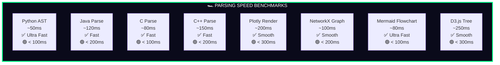

<br>

<!-- ═══════════════════════════════════════════════════════════════════════════ -->
<!-- NEON WAVE DIVIDER 14                                                     -->
<!-- ═══════════════════════════════════════════════════════════════════════════ -->

<p align="center">
  
</p>

<br>

<!-- ═══════════════════════════════════════════════════════════════════════════ -->
<!-- SECTION 14: SECURITY                                                       -->
<!-- ═══════════════════════════════════════════════════════════════════════════ -->

<h1 align="center">
   
  Security
</h1>

<h3 align="center">🛡️ Security Architecture</h3>

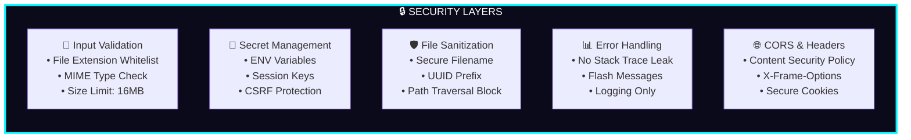

<br>

<!-- ═══════════════════════════════════════════════════════════════════════════ -->
<!-- NEON WAVE DIVIDER 15                                                     -->
<!-- ═══════════════════════════════════════════════════════════════════════════ -->

<p align="center">
  
</p>

<br>

<!-- ═══════════════════════════════════════════════════════════════════════════ -->
<!-- SECTION 15: ERROR HANDLING                                               -->
<!-- ═══════════════════════════════════════════════════════════════════════════ -->

<h1 align="center">
   
  Error Handling
</h1>

<h3 align="center">🚨 Error Recovery Flow</h3>

```mermaid
flowchart TD
    START([User Action]) --> TRY{Try Block}

    TRY -->|Success| PROCESS[Process Request]
    PROCESS --> RETURN[Return Response]
    RETURN --> END([✅ Success])

    TRY -->|Exception| CATCH{Catch Block}

    CATCH -->|ValueError| VAL_ERR["⚠️ Invalid Input<br/>Flash Warning Message"]
    CATCH -->|FileNotFound| FILE_ERR["📁 File Missing<br/>Flash Error Message"]
    CATCH -->|JSONDecode| JSON_ERR["💾 Corrupt Data<br/>Reset to Default"]
    CATCH -->|Unhandled| UNK_ERR["🔥 Server Error<br/>Log Traceback<br/>Generic Message"]

    VAL_ERR --> REDIRECT[Redirect to Safe Page]
    FILE_ERR --> REDIRECT
    JSON_ERR --> REDIRECT
    UNK_ERR --> REDIRECT

    REDIRECT --> END2([🔄 Recovery])

    style START fill:#0a0a1a,stroke:#00f2ff,stroke-width:2px,color:#fff
    style END fill:#001a00,stroke:#00ff88,stroke-width:3px,color:#fff
    style END2 fill:#1a1a00,stroke:#ffcc00,stroke-width:2px,color:#fff
    style VAL_ERR fill:#1a1a00,stroke:#ffcc00,stroke-width:2px,color:#fff
    style FILE_ERR fill:#1a0a00,stroke:#ff8800,stroke-width:2px,color:#fff
    style JSON_ERR fill:#1a001a,stroke:#ff00e6,stroke-width:2px,color:#fff
    style UNK_ERR fill:#1a0000,stroke:#ff0044,stroke-width:2px,color:#fff
```

<br>

<!-- ═══════════════════════════════════════════════════════════════════════════ -->
<!-- NEON WAVE DIVIDER 16                                                     -->
<!-- ═══════════════════════════════════════════════════════════════════════════ -->

<p align="center">
  
</p>

<br>

<!-- ═══════════════════════════════════════════════════════════════════════════ -->
<!-- SECTION 16: LICENSE                                                        -->
<!-- ═══════════════════════════════════════════════════════════════════════════ -->

<h1 align="center">
   
  License
</h1>

<div align="center">

```
MIT License

Copyright (c) 2024 issu321 (Mohammed Usman)

Permission is hereby granted, free of charge, to any person obtaining a copy
of this software and associated documentation files (the "Software"), to deal
in the Software without restriction, including without limitation the rights
to use, copy, modify, merge, publish, distribute, sublicense, and/or sell
copies of the Software, and to permit persons to whom the Software is
furnished to do so, subject to the following conditions:

The above copyright notice and this permission notice shall be included in all
copies or substantial portions of the Software.

THE SOFTWARE IS PROVIDED "AS IS", WITHOUT WARRANTY OF ANY KIND, EXPRESS OR
IMPLIED, INCLUDING BUT NOT LIMITED TO THE WARRANTIES OF MERCHANTABILITY,
FITNESS FOR A PARTICULAR PURPOSE AND NONINFRINGEMENT.
```

</div>

<br>

<!-- ═══════════════════════════════════════════════════════════════════════════ -->
<!-- NEON WAVE DIVIDER 17                                                     -->
<!-- ═══════════════════════════════════════════════════════════════════════════ -->

<p align="center">
  
</p>

<br>

<!-- ═══════════════════════════════════════════════════════════════════════════ -->
<!-- SECTION 17: DEVELOPER CARD                                               -->
<!-- ═══════════════════════════════════════════════════════════════════════════ -->

<h1 align="center">
   
  Developer
</h1>

<div align="center">

<!-- DEVELOPER NEON CARD -->
<table>
  <tr>
    <td align="center" width="600">
      <br>
      <br>
      <br><br>
      <b style="font-size:20px; color:#00f2ff;">🧠 AI Developer &nbsp;•&nbsp; 🎨 Viz Engineer &nbsp;•&nbsp; 🚀 Open Source</b><br><br>
      <a href="https://github.com/issu321">
        
      </a>
      <a href="https://github.com/issu321/Programming-Visualization">
        
      </a>
      <br><br>
    </td>
  </tr>
</table>

<br>

<!-- GITHUB STATS -->


<br><br>

<!-- TROPHIES -->


</div>

<br>

<!-- ═══════════════════════════════════════════════════════════════════════════ -->
<!-- NEON WAVE DIVIDER 18                                                     -->
<!-- ═══════════════════════════════════════════════════════════════════════════ -->

<p align="center">
  
</p>

<br>

<!-- ═══════════════════════════════════════════════════════════════════════════ -->
<!-- FOOTER                                                                     -->
<!-- ═══════════════════════════════════════════════════════════════════════════ -->

<div align="center">

<!-- FOOTER WAVE -->


<br><br>

**Built with 💜, 🔥, and a lot of ☕ by Mohammed Usman**

*Transforming code into cognition, one visualization at a time.*

<br>

<p>
  
  
  
</p>

<br><br>

<!-- VISITOR COUNT -->


<br><br>

<!-- SNAKE ANIMATION -->


</div>
