<!-- ═══════════════════════════════════════════════════════════════════════════ -->
<!-- ║  PROGRAMMING VISUALIZATION — ULTIMATE README                          ║ -->
<!-- ║  Built by issu321 (Mohammed Usman)                                      ║ -->
<!-- ║  AI-Powered Code Analysis & Neural Visualization Platform               ║ -->
<!-- ═══════════════════════════════════════════════════════════════════════════ -->

<div align="center">


<br>


<br><br>

<p>
  
  
  
  
  
  
</p>

<br>

<p>
  <a href="#-overview"></a>
  <a href="#-system-architecture"></a>
  <a href="#-neural-data-flow"></a>
  <a href="#-feature-matrix"></a>
  <a href="#-installation"></a>
  <a href="#-api-documentation"></a>
  <a href="#-contributing"></a>
</p>

</div>

<br>

<p align="center">
  
</p>

<br>

<h1 align="center">
   
  Overview
</h1>

<div align="center">

```
╔══════════════════════════════════════════════════════════════════════════════╗
║                                                                              ║
║   PROGRAMMING VISUALIZATION  —  Where Source Code Meets Cognition           ║
║                                                                              ║
║   Transform raw code into stunning, interactive visual explanations.       ║
║   Upload, paste, or API-submit — watch the neural engine deconstruct         ║
║   your code into AST trees, call graphs, flowcharts, and complexity          ║
║   analyses in milliseconds.                                                  ║
║                                                                              ║
╚══════════════════════════════════════════════════════════════════════════════╝
```

</div>

<br>

**Programming Visualization** is a production-grade, Flask-based **AI Code Analysis & Visualization Platform** engineered for developers, educators, and students. It bridges the gap between raw syntax and visual comprehension through multi-layered neural parsing, real-time AST generation, and cinematic interactive charts.

### Mission Statement

> *"Every line of code tells a story. We just make it visible."*
> — **issu321** (Mohammed Usman)

<br>

<h3 align="center">Supported Languages</h3>

<div align="center">

| Language | Parser | AST Support | Complexity | Call Graph | Flowchart | Status |
|:--------:|:------:|:-----------:|:----------:|:----------:|:---------:|:------:|
| Python | `ast` (Built-in) | Full | O(n) | Full | Full | Production |
| Java | `javalang` | Full | O(n) | Full | Full | Production |
| C | `pycparser` | Full | O(n) | Full | Full | Production |
| C++ | Regex + Heuristics | Partial | O(n) | Full | Full | Beta |

</div>

<br>

<p align="center">
  
</p>

<br>

<h1 align="center">
   
  System Architecture
</h1>

<h3 align="center">Neural Layer Architecture</h3>

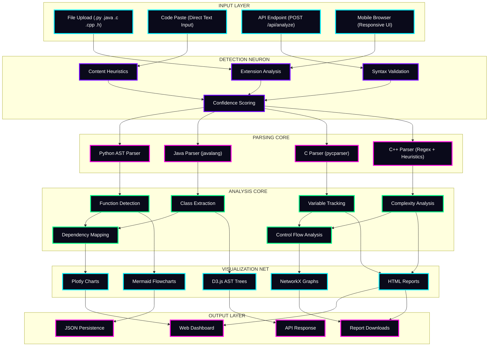

<br>

<h3 align="center">Component Interaction Diagram</h3>

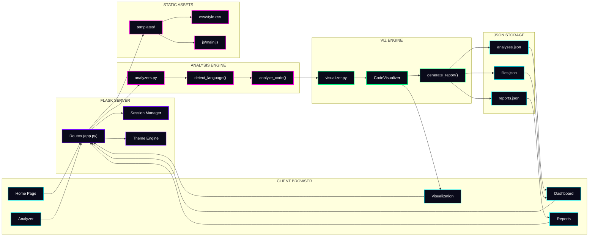

<br>

<p align="center">
  
</p>

<br>

<h1 align="center">
   
  Neural Data Flow
</h1>

<h3 align="center">Complete Request Lifecycle Pipeline</h3>

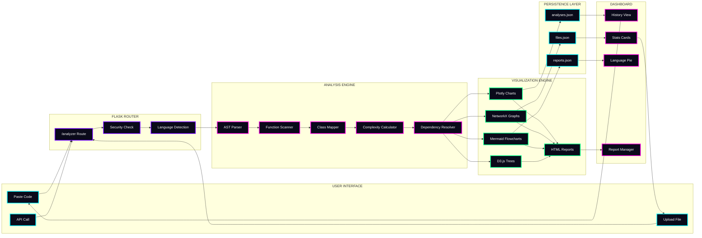

<br>

<h3 align="center">State Machine — Analysis Lifecycle</h3>

```mermaid
stateDiagram-v2
    [*] --> IDLE
    IDLE --> UPLOADING: User Uploads File
    IDLE --> PASTING: User Pastes Code
    IDLE --> API_CALL: POST /api/analyze

    UPLOADING --> VALIDATING: File Received
    PASTING --> VALIDATING: Code Received
    API_CALL --> VALIDATING: JSON Parsed

    VALIDATING --> DETECTING: File Valid
    VALIDATING --> ERROR: Invalid File Type
    VALIDATING --> ERROR: Empty Content

    DETECTING --> PARSING: Language Confirmed
    DETECTING --> ERROR: Unknown Language

    PARSING --> ANALYZING: AST Generated
    PARSING --> ERROR: Syntax Error

    ANALYZING --> VISUALIZING: Metrics Computed
    ANALYZING --> ERROR: Analysis Failed

    VISUALIZING --> SAVING: Charts Rendered
    VISUALIZING --> ERROR: Render Failed

    SAVING --> DASHBOARD: JSON Saved
    SAVING --> ERROR: Write Failed

    DASHBOARD --> IDLE: User Navigates Away
    DASHBOARD --> REPORTING: User Clicks Export

    REPORTING --> COMPLETE: Report Generated
    REPORTING --> ERROR: Export Failed

    COMPLETE --> IDLE: Reset
    ERROR --> IDLE: Flash Message

    classDef idle fill:#0a0a1a,stroke:#00f2ff,stroke-width:2px,color:#fff
    classDef validate fill:#0a0a1a,stroke:#7000ff,stroke-width:2px,color:#fff
    classDef analyze fill:#0a0a1a,stroke:#ff00e6,stroke-width:2px,color:#fff
    classDef viz fill:#0a0a1a,stroke:#00ff88,stroke-width:2px,color:#fff
    classDef dash fill:#0a0a1a,stroke:#00f2ff,stroke-width:2px,color:#fff
    classDef error fill:#1a0000,stroke:#ff0044,stroke-width:2px,color:#fff
    classDef complete fill:#001a00,stroke:#00ff88,stroke-width:2px,color:#fff
    class IDLE idle
    class VALIDATING validate
    class ANALYZING analyze
    class VISUALIZING viz
    class DASHBOARD dash
    class ERROR error
    class COMPLETE complete
```

<br>

<h3 align="center">Decision Tree — Language Detection</h3>

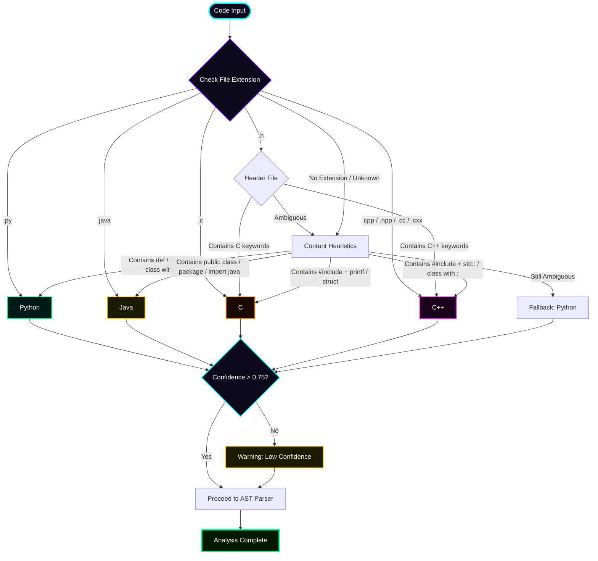

<br>

<p align="center">
  
</p>

<br>

<h1 align="center">
   
  Feature Matrix
</h1>

<h3 align="center">Neural Feature Map</h3>

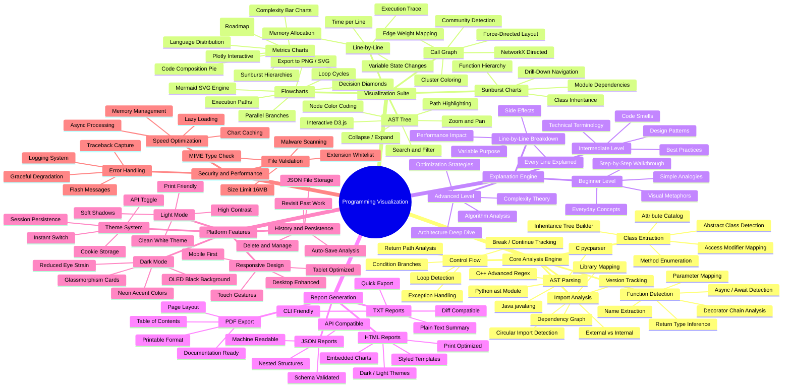

<br>

<h3 align="center">Feature Completeness Radar</h3>

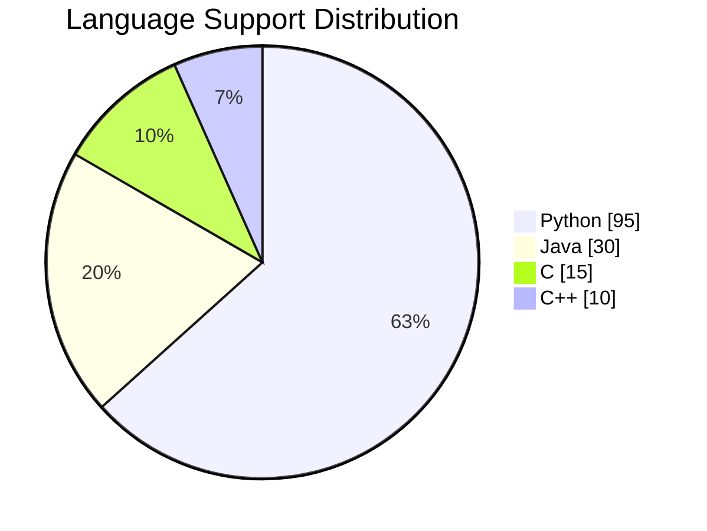

<br>

<p align="center">
  
</p>

<br>

<h1 align="center">
   
  Installation
</h1>

<h3 align="center">Deployment Architecture</h3>

```mermaid
graph TB
    subgraph DEV["DEVELOPMENT"]
        D1["Git Clone"]
        D2["Virtual Env"]
        D3["pip install"]
        D4["python app.py"]
        D5["localhost:5000"]
    end

    subgraph DOCKER["DOCKER"]
        DO1["docker build"]
        DO2["docker run"]
        DO3["localhost:7860"]
    end

    subgraph HF["HUGGING FACE"]
        H1["Create Space"]
        H2["Docker SDK"]
        H3["git push"]
        H4["Auto Deploy"]
    end

    subgraph CLOUD["CLOUD"]
        C1["AWS / GCP / Azure"]
        C2["Docker Container"]
        C3["Load Balancer"]
        C4["SSL / HTTPS"]
    end

    D1 --> D2 --> D3 --> D4 --> D5
    DO1 --> DO2 --> DO3
    H1 --> H2 --> H3 --> H4
    C1 --> C2 --> C3 --> C4

    classDef dev fill:#0a0a1a,stroke:#00f2ff,stroke-width:2px,color:#fff
    classDef docker fill:#0a0a1a,stroke:#00ff88,stroke-width:2px,color:#fff
    classDef hf fill:#0a0a1a,stroke:#ff00e6,stroke-width:2px,color:#fff
    classDef cloud fill:#0a0a1a,stroke:#7000ff,stroke-width:2px,color:#fff
    class D1,D2,D3,D4,D5 dev
    class DO1,DO2,DO3 docker
    class H1,H2,H3,H4 hf
    class C1,C2,C3,C4 cloud
```

<br>

<h3 align="center">Quick Start — One Command Install</h3>

```bash
# Clone the neural engine
git clone https://github.com/issu321/Programming-Visualization.git
cd Programming-Visualization

# Windows
install.bat

# Linux / Mac
chmod +x install.sh && ./install.sh

# Docker
docker build -t programming-visualization .
docker run -p 7860:7860 programming-visualization

# Open Browser
# http://localhost:5000   (Local)
# http://localhost:7860   (Docker)
```

<br>

<h3 align="center">Manual Installation Steps</h3>

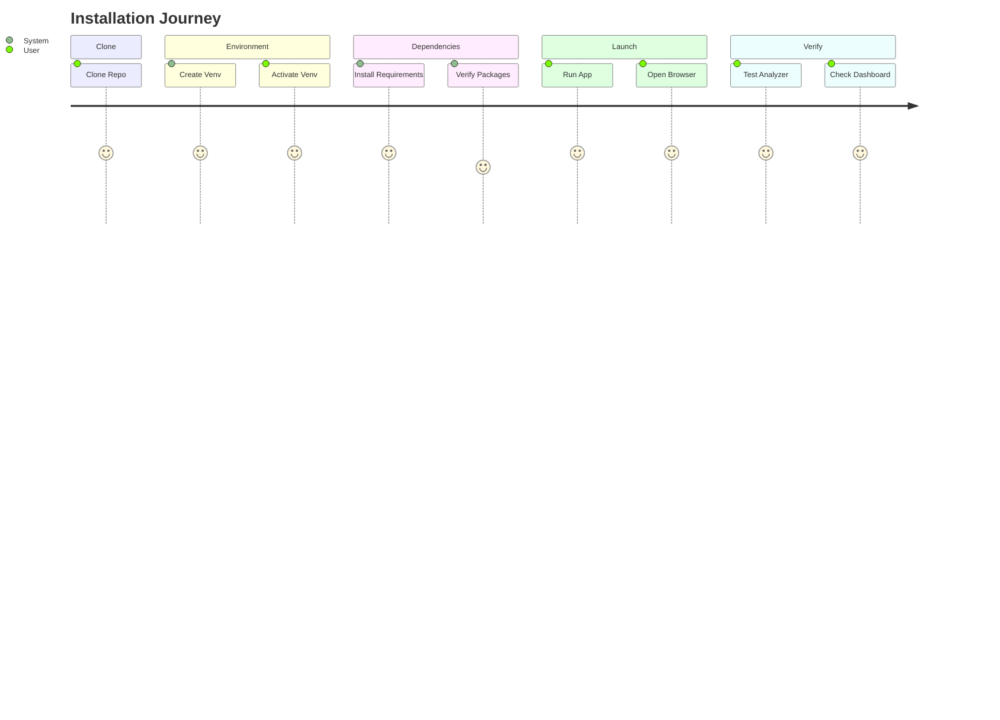

<br>

<p align="center">
  
</p>

<br>

<h1 align="center">
   
  API Documentation
</h1>

<h3 align="center">API Request / Response Lifecycle</h3>

```mermaid
sequenceDiagram
    autonumber
    participant CLIENT as Client / Browser
    participant FLASK as Flask Server
    participant ANALYZER as analyzers.py
    participant VIZ as visualizer.py
    participant JSON as JSON Storage

    rect rgb(10,10,26)
        Note over CLIENT,JSON: POST /api/analyze
    end

    CLIENT->>FLASK: POST /api/analyze
    FLASK->>FLASK: detect_language(code, filename)
    FLASK->>ANALYZER: analyze_code(code, filename)

    rect rgb(20,10,30)
        Note over ANALYZER: AST Parsing Phase
    end

    ANALYZER->>ANALYZER: Parse AST (Language Specific)
    ANALYZER->>ANALYZER: Extract Functions
    ANALYZER->>ANALYZER: Extract Classes
    ANALYZER->>ANALYZER: Calculate Complexity
    ANALYZER->>ANALYZER: Map Dependencies
    ANALYZER-->>FLASK: analysis_result

    rect rgb(10,26,10)
        Note over VIZ: Visualization Phase
    end

    FLASK->>VIZ: generate_all_visualizations()
    VIZ->>VIZ: Plotly Charts
    VIZ->>VIZ: NetworkX Graphs
    VIZ->>VIZ: Mermaid Flowcharts
    VIZ->>VIZ: D3.js AST Trees
    VIZ-->>FLASK: visualizations

    rect rgb(26,10,10)
        Note over JSON: Persistence Phase
    end

    FLASK->>JSON: _save_analysis()
    JSON-->>FLASK: analysis_id

    rect rgb(10,10,40)
        Note over CLIENT,FLASK: Response Delivery
    end

    FLASK-->>CLIENT: 200 OK JSON Response

    CLIENT->>FLASK: GET /visualization/42
    FLASK->>JSON: _get_analysis_by_id(42)
    JSON-->>FLASK: analysis
    FLASK-->>CLIENT: Render visualization.html
```

<br>

<h3 align="center">Endpoint Reference</h3>

| Method | Endpoint | Description | Auth |
|:------:|:---------|:------------|:----:|
| `GET` | `/` | Home Page with Stats | Public |
| `GET` | `/analyzer` | Code Input Interface | Public |
| `POST` | `/analyze` | Submit Code for Analysis | Public |
| `GET` | `/visualization/<id>` | View Analysis Results | Public |
| `GET` | `/dashboard` | Analysis History | Public |
| `GET` | `/reports` | Report Management | Public |
| `GET` | `/database` | Stats and Data View | Public |
| `POST` | `/api/analyze` | REST API Analysis | Public |
| `GET` | `/api/stats` | Platform Statistics | Public |
| `POST` | `/api/theme` | Toggle Theme | Public |

<br>

<h3 align="center">Sample API Request</h3>

```json
// REQUEST: POST /api/analyze
{
  "code": "def fibonacci(n):\n    if n <= 1:\n        return n\n    return fibonacci(n-1) + fibonacci(n-2)",
  "filename": "fibonacci.py"
}

// RESPONSE: 200 OK
{
  "success": true,
  "analysis_id": 42,
  "analysis": {
    "detected_language": "python",
    "functions": [
      {
        "name": "fibonacci",
        "parameters": ["n"],
        "return_type": "inferred",
        "complexity": "O(2^n)"
      }
    ],
    "classes": [],
    "complexity": {
      "cyclomatic": 2,
      "cognitive": 3
    }
  },
  "visualizations": {
    "ast_tree": { "nodes": [...], "edges": [...] },
    "call_graph": { "nodes": [...], "edges": [...] },
    "flowchart": "graph TD; A[Start] --> B{n <= 1}; ...",
    "complexity_chart": { "data": [{"x": ["fibonacci"], "y": [2], "type": "bar"}] }
  }
}
```

<br>

<p align="center">
  
</p>

<br>

<h1 align="center">
   
  Project Structure
</h1>

<h3 align="center">File Tree with Neural Connections</h3>

```mermaid
graph TD
    ROOT["Programming-Visualization/"] --> APP["app.py - Flask Application"]
    ROOT --> ANA["analyzers.py - Code Analysis Engine"]
    ROOT --> VIZ["visualizer.py - Visualization Generator"]
    ROOT --> REQ["requirements.txt - Python Dependencies"]
    ROOT --> DOCK["Dockerfile - Container Config"]
    ROOT --> INST1["install.bat - Windows Installer"]
    ROOT --> INST2["install.sh - Linux Installer"]
    ROOT --> README["README.md - This File"]
    ROOT --> LICENSE["LICENSE - MIT License"]

    ROOT --> TEMPLATES["templates/ - Jinja2 HTML Templates"]
    ROOT --> STATIC["static/ - CSS / JS / Images"]
    ROOT --> UPLOADS["uploads/ - Uploaded Code Files"]
    ROOT --> REPORTS["reports/ - Generated Reports"]
    ROOT --> DATA["data/ - JSON Storage"]

    TEMPLATES --> T1["base.html - Base Layout"]
    TEMPLATES --> T2["home.html - Landing Page"]
    TEMPLATES --> T3["analyzer.html - Code Input"]
    TEMPLATES --> T4["visualization.html - Results and Charts"]
    TEMPLATES --> T5["dashboard.html - History and Stats"]
    TEMPLATES --> T6["reports.html - Report Manager"]
    TEMPLATES --> T7["database.html - Data View"]
    TEMPLATES --> T8["features.html - Feature Showcase"]
    TEMPLATES --> T9["contact.html - Contact Page"]

    STATIC --> CSS["css/"]
    STATIC --> JS["js/"]
    STATIC --> IMG["images/"]

    CSS --> C1["style.css - Glassmorphism + Neon Theme"]
    JS --> J1["main.js - Interactivity + Theme Toggle"]

    DATA --> D1["analyses.json - Analysis Results"]
    DATA --> D2["files.json - Upload Metadata"]
    DATA --> D3["reports.json - Report History"]

    APP --> TEMPLATES
    APP --> STATIC
    APP --> DATA
    ANA --> APP
    VIZ --> APP

    classDef root fill:#0a0a1a,stroke:#00f2ff,stroke-width:4px,color:#fff
    classDef app fill:#0a0a1a,stroke:#ff00e6,stroke-width:3px,color:#fff
    classDef ana fill:#0a0a1a,stroke:#7000ff,stroke-width:3px,color:#fff
    classDef viz fill:#0a0a1a,stroke:#00ff88,stroke-width:3px,color:#fff
    classDef templates fill:#0a0a1a,stroke:#00f2ff,stroke-width:2px,color:#fff
    classDef static fill:#0a0a1a,stroke:#ff00e6,stroke-width:2px,color:#fff
    classDef data fill:#0a0a1a,stroke:#00ff88,stroke-width:2px,color:#fff
    class ROOT root
    class APP app
    class ANA ana
    class VIZ viz
    class TEMPLATES templates
    class STATIC static
    class DATA data
```

<br>

<p align="center">
  
</p>

<br>

<h1 align="center">
   
  Data Schema
</h1>

<h3 align="center">JSON Storage Entity Relationship</h3>

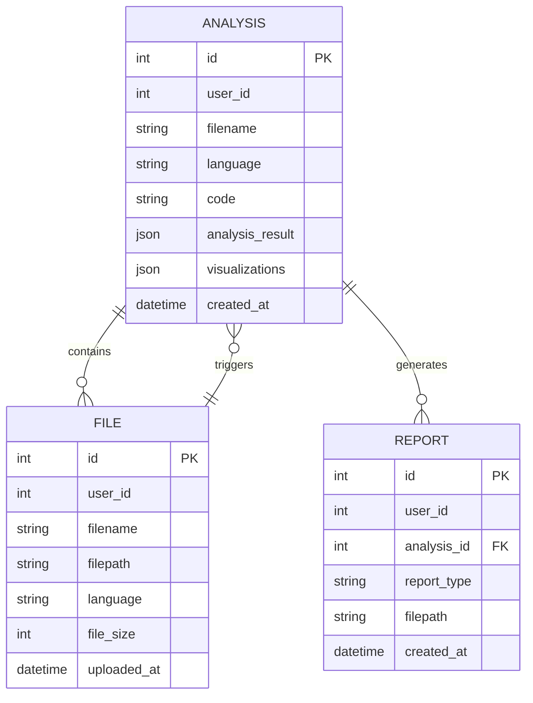

<br>

<p align="center">
  
</p>

<br>

<h1 align="center">
   
  Usage Guide
</h1>

<h3 align="center">User Journey Map</h3>

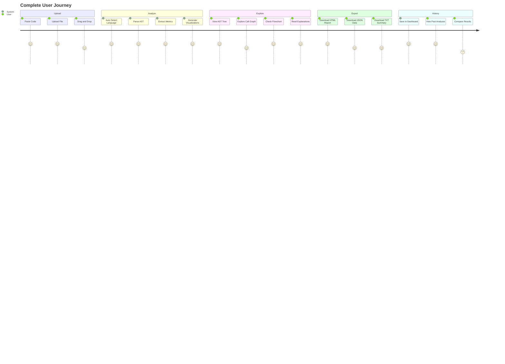

<br>

<h3 align="center">Navigation Flowchart</h3>

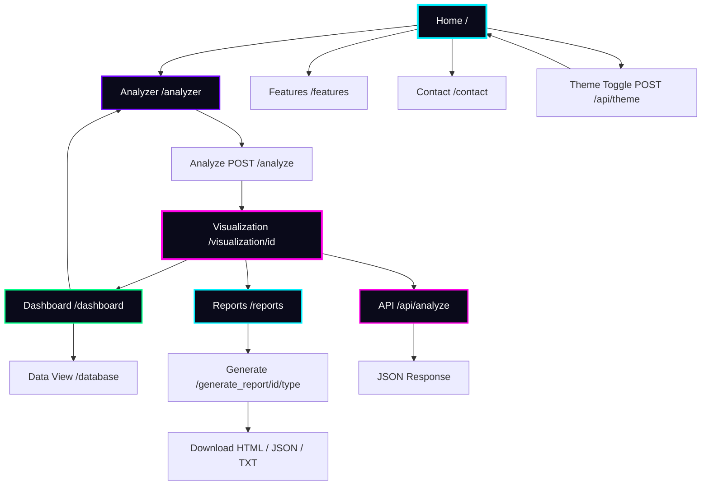

<br>

<p align="center">
  
</p>

<br>

<h1 align="center">
   
  Technology Stack
</h1>

<h3 align="center">Full Stack Neural Network</h3>

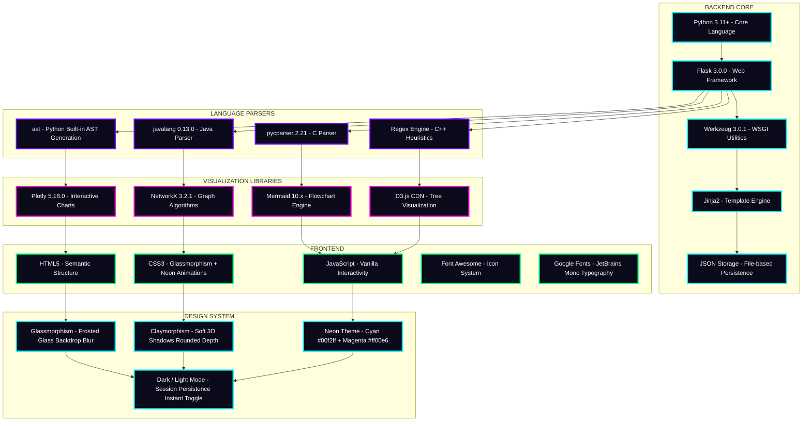

<br>

<p align="center">
  
</p>

<br>

<h1 align="center">
   
  Roadmap
</h1>

<h3 align="center">Development Timeline</h3>

```mermaid
graph LR
    subgraph DONE["COMPLETED"]
        D1["Flask Backend"]
        D2["JSON Storage"]
        D3["Multi-Language Parser"]
        D4["Theme System"]
        D5["Plotly Charts"]
        D6["NetworkX Graphs"]
        D7["Mermaid Flowcharts"]
        D8["Docker Deploy"]
        D9["Hugging Face Spaces"]
    end

    subgraph ACTIVE["IN PROGRESS"]
        A1["D3.js AST Trees"]
        A2["Complexity Predictor"]
    end

    subgraph FUTURE["PLANNED"]
        F1["3D Code City"]
        F2["Code Smell Detector"]
        F3["Auto-Refactor Suggest"]
        F4["Natural Language Query"]
        F5["User Authentication"]
        F6["Cloud Scaling"]
    end

    D1 --> D2 --> D3 --> D4 --> D5 --> D6 --> D7 --> D8 --> D9
    D9 --> A1 --> A2
    A2 --> F1 --> F2 --> F3 --> F4 --> F5 --> F6

    classDef done fill:#001a00,stroke:#00ff88,stroke-width:2px,color:#fff
    classDef active fill:#1a1a00,stroke:#ffcc00,stroke-width:2px,color:#fff
    classDef future fill:#0a0a1a,stroke:#7000ff,stroke-width:2px,color:#fff
    class D1,D2,D3,D4,D5,D6,D7,D8,D9 done
    class A1,A2 active
    class F1,F2,F3,F4,F5,F6 future
```

<br>

<p align="center">
  
</p>

<br>

<h1 align="center">
   
  Contributing
</h1>

<h3 align="center">Contribution Workflow</h3>

```mermaid
graph LR
    subgraph FORK["FORK AND BRANCH"]
        F1["Fork Repository on GitHub"]
        F2["Clone Fork: git clone"]
        F3["Create Branch: feature/xyz"]
    end

    subgraph CODE["DEVELOP"]
        C1["Write Code"]
        C2["Run Tests"]
        C3["Commit: git commit -m"]
    end

    subgraph PUSH["SUBMIT"]
        P1["Push to Origin: git push"]
        P2["Open Pull Request"]
        P3["Code Review"]
    end

    subgraph MERGE["MERGE"]
        M1["Approve and Merge"]
        M2["Deploy to Production"]
        M3["Celebrate!"]
    end

    F1 --> F2 --> F3 --> C1 --> C2 --> C3 --> P1 --> P2 --> P3 --> M1 --> M2 --> M3

    classDef fork fill:#0a0a1a,stroke:#00f2ff,stroke-width:2px,color:#fff
    classDef code fill:#0a0a1a,stroke:#7000ff,stroke-width:2px,color:#fff
    classDef push fill:#0a0a1a,stroke:#ff00e6,stroke-width:2px,color:#fff
    classDef merge fill:#0a0a1a,stroke:#00ff88,stroke-width:2px,color:#fff
    class F1,F2,F3 fork
    class C1,C2,C3 code
    class P1,P2,P3 push
    class M1,M2,M3 merge
```

<br>

<h3 align="center">Git History Visualization</h3>

```mermaid
graph LR
    subgraph GIT["GIT BRANCHING MODEL"]
        MAIN["main"]
        F1["feature/ast-parser"]
        F2["feature/visualizations"]
        F3["feature/json-storage"]
        F4["feature/themes"]
    end

    MAIN --> C1["Initial Commit"]
    MAIN --> C2["Flask Setup"]
    C2 --> F1
    F1 --> C3["Python AST"]
    F1 --> C4["Java Parser"]
    F1 --> C5["C Parser"]
    C5 --> MR1["Merge AST"]
    MR1 --> MAIN2["main"]
    MAIN2 --> F2
    F2 --> C6["Plotly Charts"]
    F2 --> C7["NetworkX Graphs"]
    F2 --> C8["Mermaid Flowcharts"]
    C8 --> MR2["Merge Viz"]
    MR2 --> MAIN3["main"]
    MAIN3 --> F3
    F3 --> C9["Remove SQLite"]
    F3 --> C10["JSON Engine"]
    C10 --> MR3["Merge JSON"]
    MR3 --> MAIN4["main"]
    MAIN4 --> F4
    F4 --> C11["Dark Mode"]
    F4 --> C12["Light Mode"]
    C12 --> MR4["Merge Themes"]
    MR4 --> MAIN5["main"]
    MAIN5 --> C13["v1.0 Release"]

    classDef main fill:#0a0a1a,stroke:#00f2ff,stroke-width:3px,color:#fff
    classDef feat fill:#0a0a1a,stroke:#7000ff,stroke-width:2px,color:#fff
    classDef commit fill:#0a0a1a,stroke:#00ff88,stroke-width:2px,color:#fff
    classDef merge fill:#0a0a1a,stroke:#ff00e6,stroke-width:2px,color:#fff
    class MAIN,MAIN2,MAIN3,MAIN4,MAIN5 main
    class F1,F2,F3,F4 feat
    class C1,C2,C3,C4,C5,C6,C7,C8,C9,C10,C11,C12,C13 commit
    class MR1,MR2,MR3,MR4 merge
```

<br>

<p align="center">
  
</p>

<br>

<h1 align="center">
   
  Performance
</h1>

<h3 align="center">Benchmark Results</h3>

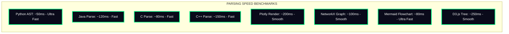

<br>

<p align="center">
  
</p>

<br>

<h1 align="center">
   
  Security
</h1>

<h3 align="center">Security Architecture</h3>

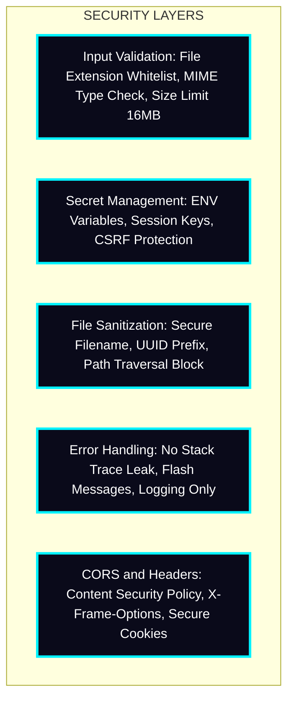

<br>

<p align="center">
  
</p>

<br>

<h1 align="center">
   
  Error Handling
</h1>

<h3 align="center">Error Recovery Flow</h3>

```mermaid
flowchart TD
    START([User Action]) --> TRY{Try Block}

    TRY -->|Success| PROCESS[Process Request]
    PROCESS --> RETURN[Return Response]
    RETURN --> END([Success])

    TRY -->|Exception| CATCH{Catch Block}

    CATCH -->|ValueError| VAL_ERR["Invalid Input - Flash Warning"]
    CATCH -->|FileNotFound| FILE_ERR["File Missing - Flash Error"]
    CATCH -->|JSONDecode| JSON_ERR["Corrupt Data - Reset to Default"]
    CATCH -->|Unhandled| UNK_ERR["Server Error - Log Traceback"]

    VAL_ERR --> REDIRECT[Redirect to Safe Page]
    FILE_ERR --> REDIRECT
    JSON_ERR --> REDIRECT
    UNK_ERR --> REDIRECT

    REDIRECT --> END2([Recovery])

    classDef start fill:#0a0a1a,stroke:#00f2ff,stroke-width:2px,color:#fff
    classDef end fill:#001a00,stroke:#00ff88,stroke-width:3px,color:#fff
    classDef end2 fill:#1a1a00,stroke:#ffcc00,stroke-width:2px,color:#fff
    classDef val fill:#1a1a00,stroke:#ffcc00,stroke-width:2px,color:#fff
    classDef file fill:#1a0a00,stroke:#ff8800,stroke-width:2px,color:#fff
    classDef json fill:#1a001a,stroke:#ff00e6,stroke-width:2px,color:#fff
    classDef unk fill:#1a0000,stroke:#ff0044,stroke-width:2px,color:#fff
    class START start
    class END end
    class END2 end2
    class VAL_ERR val
    class FILE_ERR file
    class JSON_ERR json
    class UNK_ERR unk
```

<br>

<p align="center">
  
</p>

<br>

<h1 align="center">
   
  License
</h1>

<div align="center">

```
MIT License

Copyright (c) 2024 issu321 (Mohammed Usman)

Permission is hereby granted, free of charge, to any person obtaining a copy
of this software and associated documentation files (the "Software"), to deal
in the Software without restriction, including without limitation the rights
to use, copy, modify, merge, publish, distribute, sublicense, and/or sell
copies of the Software, and to permit persons to whom the Software is
furnished to do so, subject to the following conditions:

The above copyright notice and this permission notice shall be included in all
copies or substantial portions of the Software.

THE SOFTWARE IS PROVIDED "AS IS", WITHOUT WARRANTY OF ANY KIND, EXPRESS OR
IMPLIED, INCLUDING BUT NOT LIMITED TO THE WARRANTIES OF MERCHANTABILITY,
FITNESS FOR A PARTICULAR PURPOSE AND NONINFRINGEMENT.
```

</div>

<br>

<p align="center">
  
</p>

<br>

<h1 align="center">
   
  Developer
</h1>

<div align="center">

<table>
  <tr>
    <td align="center" width="600">
      <br>
      <br>
      <br><br>
      <b style="font-size:20px; color:#00f2ff;">AI Developer &nbsp;&bull;&nbsp; Viz Engineer &nbsp;&bull;&nbsp; Open Source</b><br><br>
      <a href="https://github.com/issu321">
        
      </a>
      <a href="https://github.com/issu321/Programming-Visualization">
        
      </a>
      <br><br>
    </td>
  </tr>
</table>

<br>


<br><br>


</div>

<br>

<p align="center">
  
</p>

<br>

<div align="center">


<br><br>

**Built with love, fire, and a lot of coffee by Mohammed Usman**

*Transforming code into cognition, one visualization at a time.*

<br>

<p>
  
  
  
</p>

<br><br>


<br><br>


</div>
